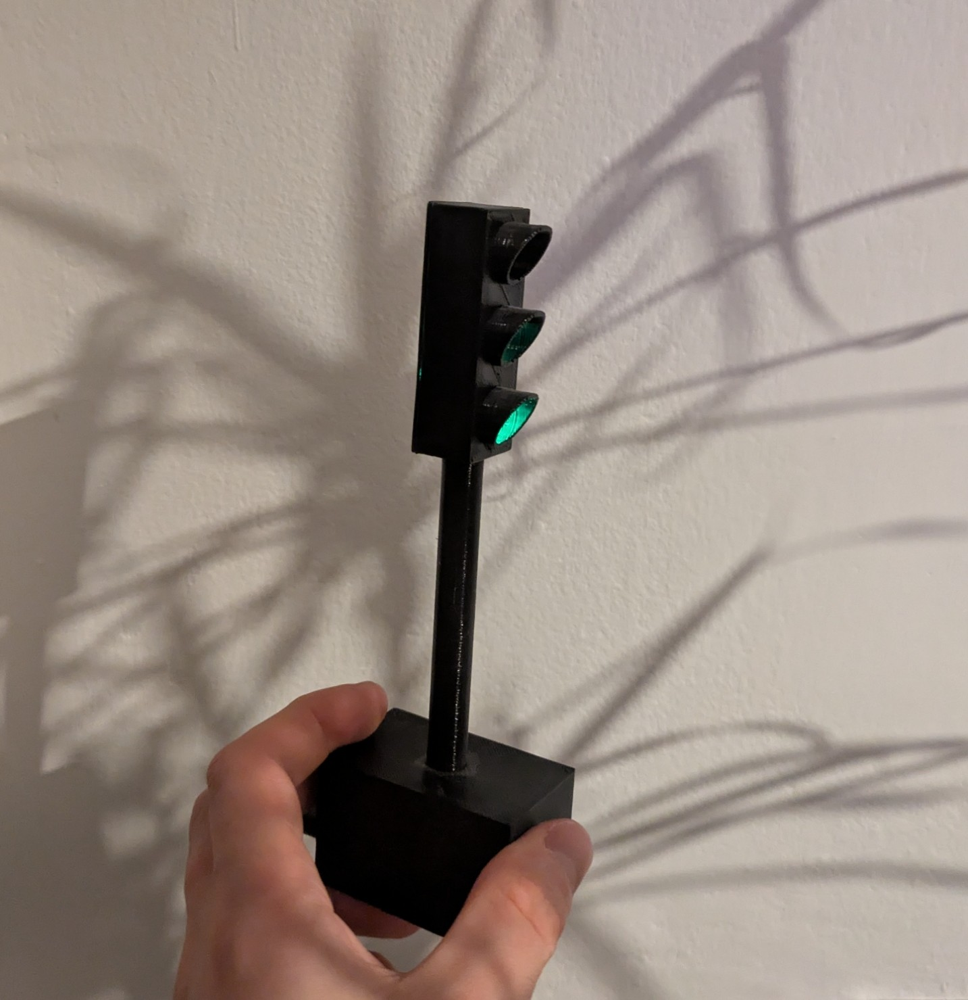
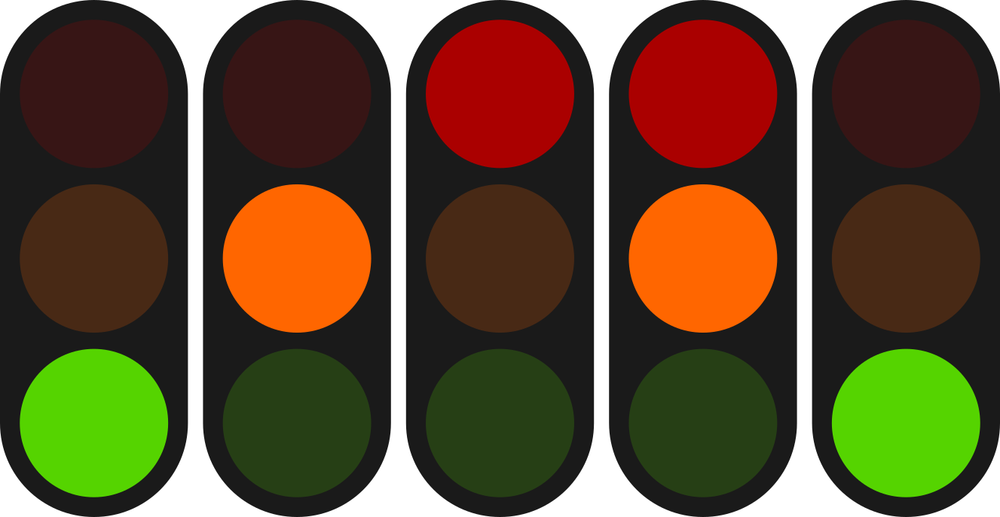
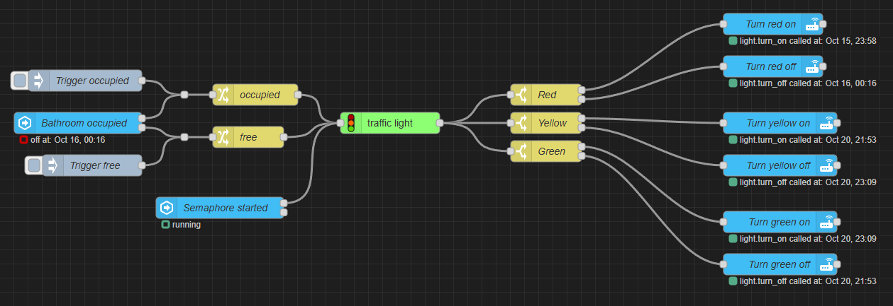
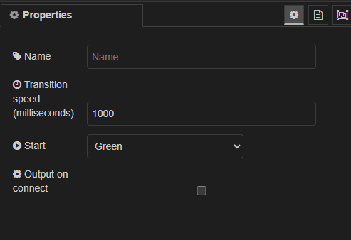

# node-red-contrib-traffic-light [](https://www.npmjs.com/package/node-red-contrib-traffic-light) 



This is a Node-RED package to manage a traffic light.

### Life cycle



#### Stable states

- Only green
- Only red

#### Transition states

- Only orange
- Orange + red

### Example usage

Motion sensor in bathroom + smart light with three leds





<!-- prettier-ignore -->
```json
[{"id":"e2338bd20fc83b52","type":"server-state-changed","z":"434092ac8e73f416","name":"Bathroom occupied","server":"11aba541.2293bb","version":5,"outputs":2,"exposeAsEntityConfig":"","entityId":"binary_sensor.bathroom_occupied","entityIdType":"exact","outputInitially":true,"stateType":"str","ifState":"on","ifStateType":"str","ifStateOperator":"is","outputOnlyOnStateChange":true,"for":"0","forType":"num","forUnits":"minutes","ignorePrevStateNull":false,"ignorePrevStateUnknown":false,"ignorePrevStateUnavailable":false,"ignoreCurrentStateUnknown":false,"ignoreCurrentStateUnavailable":false,"outputProperties":[{"property":"payload","propertyType":"msg","value":"","valueType":"entityState"},{"property":"data","propertyType":"msg","value":"","valueType":"eventData"},{"property":"topic","propertyType":"msg","value":"","valueType":"triggerId"}],"x":390,"y":180,"wires":[["86555882fc06ad26"],["004e0fe8cbfd3ded"]]},{"id":"2aafec1c3dacd7e9","type":"api-call-service","z":"434092ac8e73f416","name":"Turn red on","server":"11aba541.2293bb","version":5,"debugenabled":false,"domain":"light","service":"turn_on","areaId":[],"deviceId":[],"entityId":["light.semaphore_top"],"data":"{\"rgb_color\": [255, 0, 0], \"brightness\": 255}","dataType":"jsonata","mergeContext":"","mustacheAltTags":false,"outputProperties":[],"queue":"last","x":1370,"y":40,"wires":[[]]},{"id":"99df05380d09def3","type":"api-call-service","z":"434092ac8e73f416","name":"Turn orange on","server":"11aba541.2293bb","version":5,"debugenabled":false,"domain":"light","service":"turn_on","areaId":[],"deviceId":[],"entityId":["light.semaphore_middle"],"data":"{\"rgb_color\": [255, 165, 0], \"brightness\": 255}","dataType":"jsonata","mergeContext":"","mustacheAltTags":false,"outputProperties":[],"queue":"last","x":1380,"y":180,"wires":[[]]},{"id":"745565a79ab370c4","type":"api-call-service","z":"434092ac8e73f416","name":"Turn green on","server":"11aba541.2293bb","version":5,"debugenabled":false,"domain":"light","service":"turn_on","areaId":[],"deviceId":[],"entityId":["light.semaphore_bottom"],"data":"{\"rgb_color\": [0, 255, 0], \"brightness\": 255}","dataType":"jsonata","mergeContext":"","mustacheAltTags":false,"outputProperties":[],"queue":"last","x":1380,"y":320,"wires":[[]]},{"id":"4b5509d4fdda5fd2","type":"api-call-service","z":"434092ac8e73f416","name":"Turn red off","server":"11aba541.2293bb","version":5,"debugenabled":false,"domain":"light","service":"turn_off","areaId":[],"deviceId":[],"entityId":["light.semaphore_top"],"data":"{}","dataType":"jsonata","mergeContext":"","mustacheAltTags":false,"outputProperties":[],"queue":"last","x":1370,"y":100,"wires":[[]]},{"id":"c08e5175de452d9f","type":"api-call-service","z":"434092ac8e73f416","name":"Turn orange off","server":"11aba541.2293bb","version":5,"debugenabled":false,"domain":"light","service":"turn_off","areaId":[],"deviceId":[],"entityId":["light.semaphore_middle"],"data":"{}","dataType":"jsonata","mergeContext":"","mustacheAltTags":false,"outputProperties":[],"queue":"last","x":1380,"y":240,"wires":[[]]},{"id":"2ed47c1e9f2440cc","type":"api-call-service","z":"434092ac8e73f416","name":"Turn green off","server":"11aba541.2293bb","version":5,"debugenabled":false,"domain":"light","service":"turn_off","areaId":[],"deviceId":[],"entityId":["light.semaphore_bottom"],"data":"{}","dataType":"jsonata","mergeContext":"","mustacheAltTags":false,"outputProperties":[],"queue":"last","x":1380,"y":380,"wires":[[]]},{"id":"63b793cd02558b15","type":"inject","z":"434092ac8e73f416","name":"Trigger occupied","props":[{"p":"payload"},{"p":"topic","vt":"str"}],"repeat":"","crontab":"","once":false,"onceDelay":0.1,"topic":"","payload":"","payloadType":"date","x":400,"y":120,"wires":[["86555882fc06ad26"]]},{"id":"ee7a665e8d19780e","type":"inject","z":"434092ac8e73f416","name":"Trigger free","props":[{"p":"payload"},{"p":"topic","vt":"str"}],"repeat":"","crontab":"","once":false,"onceDelay":0.1,"topic":"","payload":"","payloadType":"date","x":410,"y":240,"wires":[["004e0fe8cbfd3ded"]]},{"id":"b64679afeecb8db6","type":"change","z":"434092ac8e73f416","name":"occupied","rules":[{"t":"set","p":"payload","pt":"msg","to":"false","tot":"bool"}],"action":"","property":"","from":"","to":"","reg":false,"x":640,"y":140,"wires":[["5caec99e44e27109"]]},{"id":"0f111dd1e4f8b0b8","type":"change","z":"434092ac8e73f416","name":"free","rules":[{"t":"set","p":"payload","pt":"msg","to":"true","tot":"bool"}],"action":"","property":"","from":"","to":"","reg":false,"x":630,"y":200,"wires":[["5caec99e44e27109"]]},{"id":"5caec99e44e27109","type":"traffic light","z":"434092ac8e73f416","name":"","transitionSpeedMilliseconds":1000,"outputOnConnect":false,"start":"green","x":830,"y":180,"wires":[["8fc5db8744265b8e","73606848af48df86","59d2e95973c9e14c"]]},{"id":"8fc5db8744265b8e","type":"switch","z":"434092ac8e73f416","name":"Red","property":"payload.red.state","propertyType":"msg","rules":[{"t":"eq","v":"on","vt":"str"},{"t":"else"}],"checkall":"true","repair":false,"outputs":2,"x":1050,"y":140,"wires":[["2aafec1c3dacd7e9"],["4b5509d4fdda5fd2"]]},{"id":"73606848af48df86","type":"switch","z":"434092ac8e73f416","name":"Orange","property":"payload.orange.state","propertyType":"msg","rules":[{"t":"eq","v":"on","vt":"str"},{"t":"else"}],"checkall":"true","repair":false,"outputs":2,"x":1060,"y":180,"wires":[["99df05380d09def3"],["c08e5175de452d9f"]]},{"id":"59d2e95973c9e14c","type":"switch","z":"434092ac8e73f416","name":"Green","property":"payload.green.state","propertyType":"msg","rules":[{"t":"eq","v":"on","vt":"str"},{"t":"else"}],"checkall":"true","repair":false,"outputs":2,"x":1050,"y":220,"wires":[["745565a79ab370c4"],["2ed47c1e9f2440cc"]]},{"id":"500514a7a5ec8f85","type":"server-state-changed","z":"434092ac8e73f416","name":"Semaphore started","server":"11aba541.2293bb","version":5,"outputs":2,"exposeAsEntityConfig":"","entityId":"light.semaphore","entityIdType":"exact","outputInitially":false,"stateType":"str","ifState":"on","ifStateType":"str","ifStateOperator":"is","outputOnlyOnStateChange":true,"for":"0","forType":"num","forUnits":"minutes","ignorePrevStateNull":false,"ignorePrevStateUnknown":false,"ignorePrevStateUnavailable":false,"ignoreCurrentStateUnknown":false,"ignoreCurrentStateUnavailable":false,"outputProperties":[{"property":"payload","propertyType":"msg","value":"","valueType":"str"}],"x":590,"y":300,"wires":[["5caec99e44e27109"],[]]},{"id":"86555882fc06ad26","type":"junction","z":"434092ac8e73f416","x":540,"y":140,"wires":[["b64679afeecb8db6"]]},{"id":"004e0fe8cbfd3ded","type":"junction","z":"434092ac8e73f416","x":540,"y":200,"wires":[["0f111dd1e4f8b0b8"]]},{"id":"11aba541.2293bb","type":"server","name":"Home Assistant","version":5,"addon":true,"rejectUnauthorizedCerts":true,"ha_boolean":"y|yes|true|on|home|open","connectionDelay":true,"cacheJson":true,"heartbeat":false,"heartbeatInterval":30,"areaSelector":"friendlyName","deviceSelector":"friendlyName","entitySelector":"friendlyName","statusSeparator":"at: ","statusYear":"hidden","statusMonth":"short","statusDay":"numeric","statusHourCycle":"h23","statusTimeFormat":"h:m","enableGlobalContextStore":true}]
```
