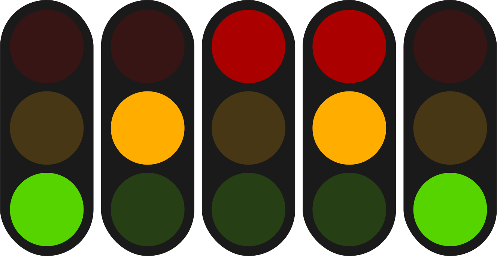

# node-red-contrib-traffic-light  

This is a Node-RED package to manage a traffic light.

### Life cycle

#### Stable states

- Only green
- Only red

#### Transition states

- Only orange
- Orange + red

### Example usage ([JSON export](./examples/ledSemaphore.json))

Motion sensor in bathroom + smart light with three leds

